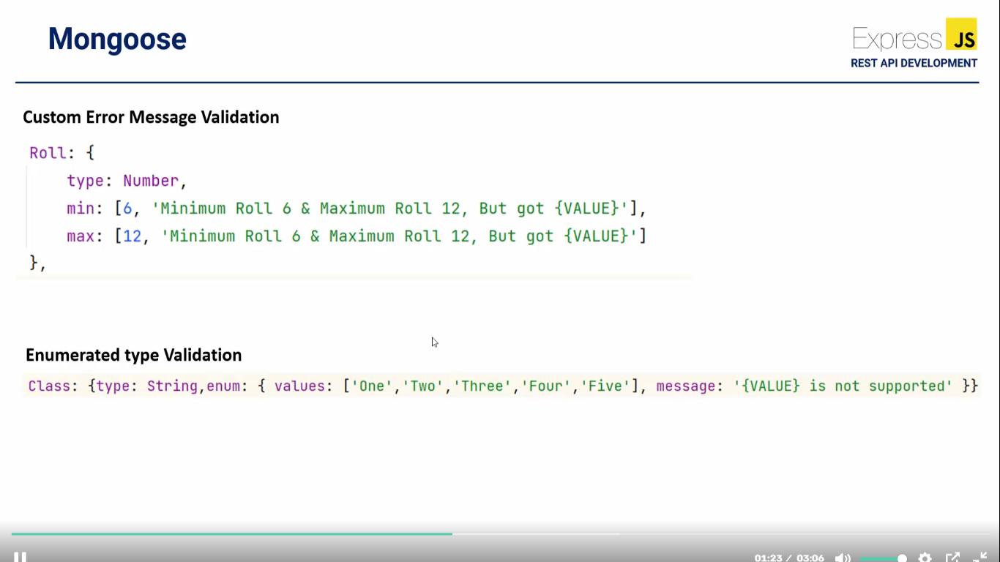
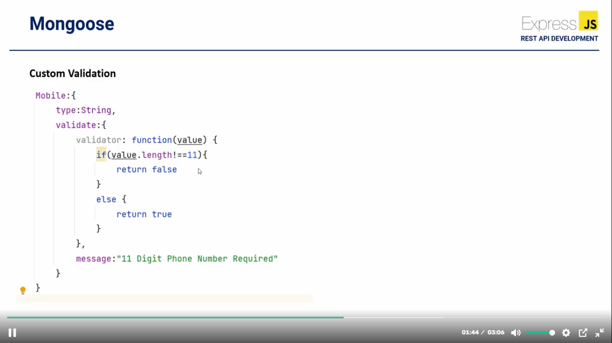
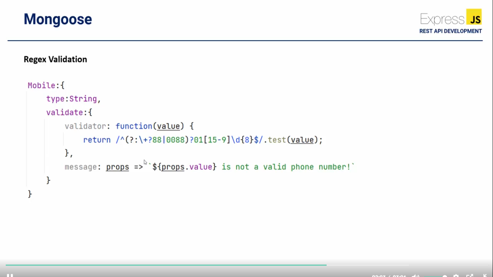

## Commit 08: Mongoose Validation:

;
;
;
;

```javascript
// Type casting Example:
import mongoose from 'mongoose';

const DataSchema = new mongoose.Schema({
    Name: {
        type: String // suppose data insert korer somoy apni ai Name er value ta Number patalen,tahole shei case number ta string a convert hoye insert hobe.
    },
    Roll: {
        type: Number
    },
    Class:{
        type: String
    },
    Remarks:{
        type: string
    },
    Adult:{
        type: Boolean
    },
    Comments:[],
    details:{},
    DOB:{
        type: Date
    }
});
 
const DemoModel = mongoose.model('students', DataSchema);

export default DemoModel;

```
```javascript
// Custom error message example:
import mongoose from 'mongoose';

const DataSchema = new mongoose.Schema({
    Name: {
        type: String
    },
    Roll: {
        type: Number,
        min: [6, "Minimum Roll is 6, but got value {VALUE}"],
        max: [12, "Maximum Roll is 12, but got value {VALUE}"]
    },
    Class:{
        type: String
    },
    Remarks:{
        type: String
    }
});
 
const DemoModel = mongoose.model('democollection', DataSchema);

export default DemoModel;

```
```javascript
//Custom Validation example:
import mongoose from 'mongoose';

const DataSchema = new mongoose.Schema({
    Name: {
        type: String
    },
    Roll: {
        type: Number,
        min: [6, "Minimum Roll is 6, but got value {VALUE}"],
        max: [12, "Maximum Roll is 12, but got value {VALUE}"]
    },
    Class:{
        type: String
    },
    Remarks:{
        type: String
    },
    Mobile:{
        type: String,
        validate:{
            validator:function(value){
                if(value.length !== 11){
                    return false;
                }else{
                    return true;
                }
            },
            message:"11 digits mobile number required."
        }
    }
});
 
const DemoModel = mongoose.model('democollection', DataSchema);

export default DemoModel;
```
```javascript
// Regex validation example:
import mongoose from 'mongoose';

const DataSchema = new mongoose.Schema({
    Name: {
        type: String
    },
    Roll: {
        type: Number,
        min: [6, "Minimum Roll is 6, but got value {VALUE}"],
        max: [12, "Maximum Roll is 12, but got value {VALUE}"]
    },
    Class: {
        type: String
    },
    Remarks: {
        type: String
    },
    Mobile: {
        type: String,
        validate: {
            validator: function (value) {
                // Corrected Regex for Bangladeshi mobile numbers
                return /^(?:\+?88|0088)?01[15-9]\d{8}$/.test(value);
            },
            message: props => `${props.value} is not a valid phone number!`
        }
    }
});

const DemoModel = mongoose.model('democollection', DataSchema);

export default DemoModel;
```
